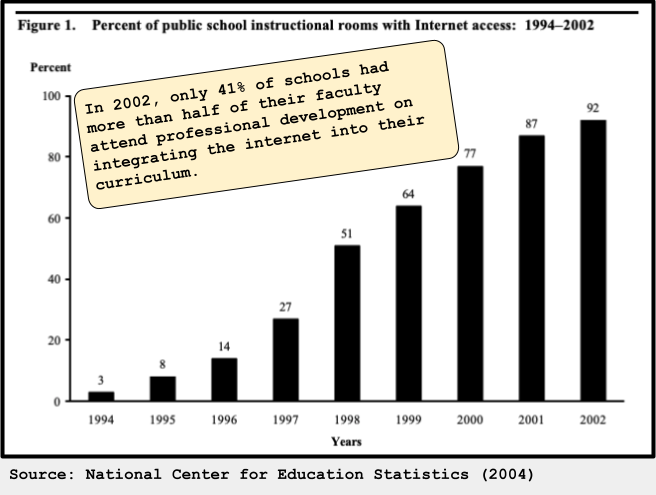

# We Have Been Here Before

- New technologies can move into classrooms very quickly.
- Professional support and curriculum integration usually move more slowly.
- AI may be another moment where adoption outpaces readiness.
