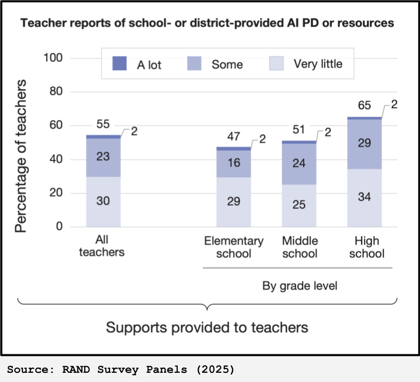

# AI Use Is Rising Faster Than Guidance

- Many teachers report little school- or district-provided AI support.
- The challenge is not just access to tools.
- The challenge is helping educators respond thoughtfully and well.
