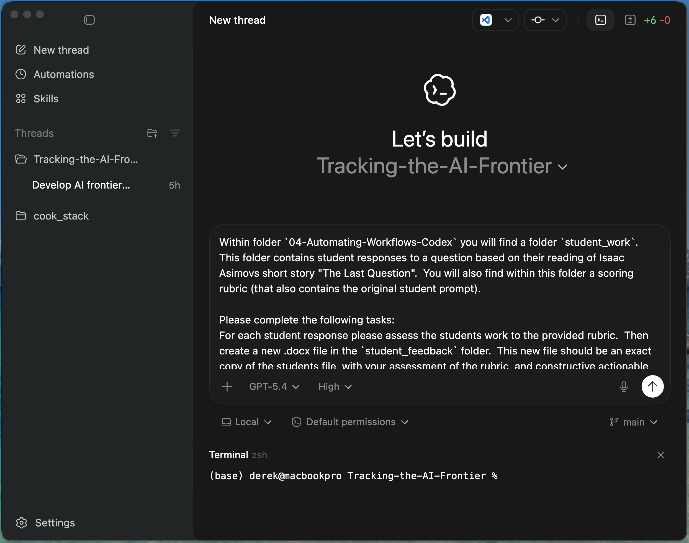

# Prompt 1: Score, Comment, and Track

## Time used by Codex: 3 minutes and 47 seconds

- Assess each student response using the provided rubric
- Create a new `.docx` file in `references/codex_example/student_feedback`
- Preserve the original student document and append rubric-based feedback
- Create `references/codex_example/student_scores.csv` with category scores and total score for each student

Prompt file: `references/codex_example/scoring-prompt.md`
