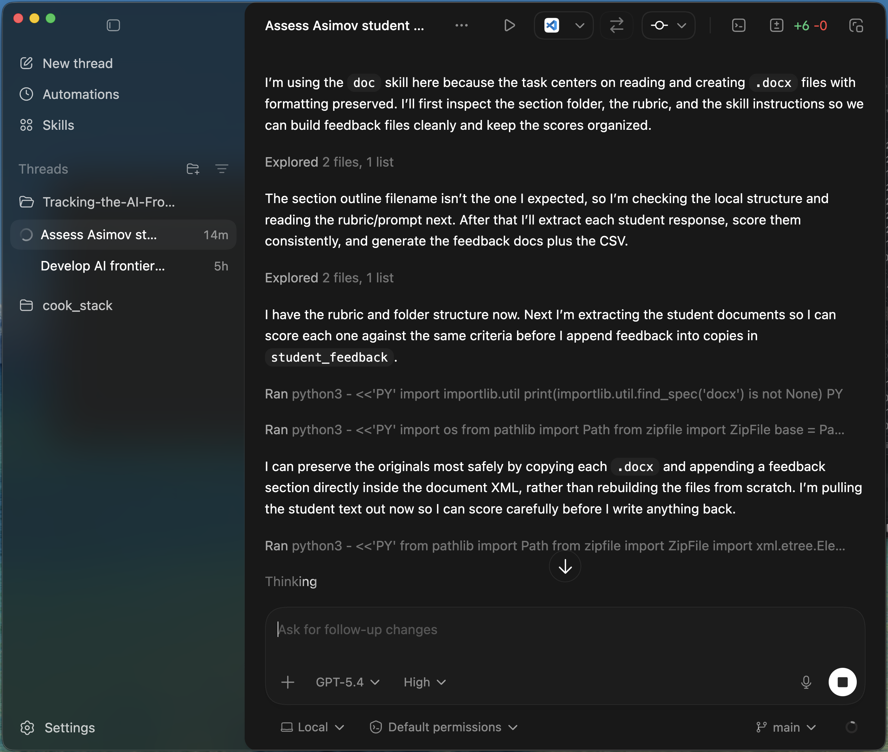

# Codex Working Across the Project

- Reads the rubric and prompt
- Extracts student writing from `.docx` files
- Scores consistently across the set
- Generates feedback docs plus a class score tracker
