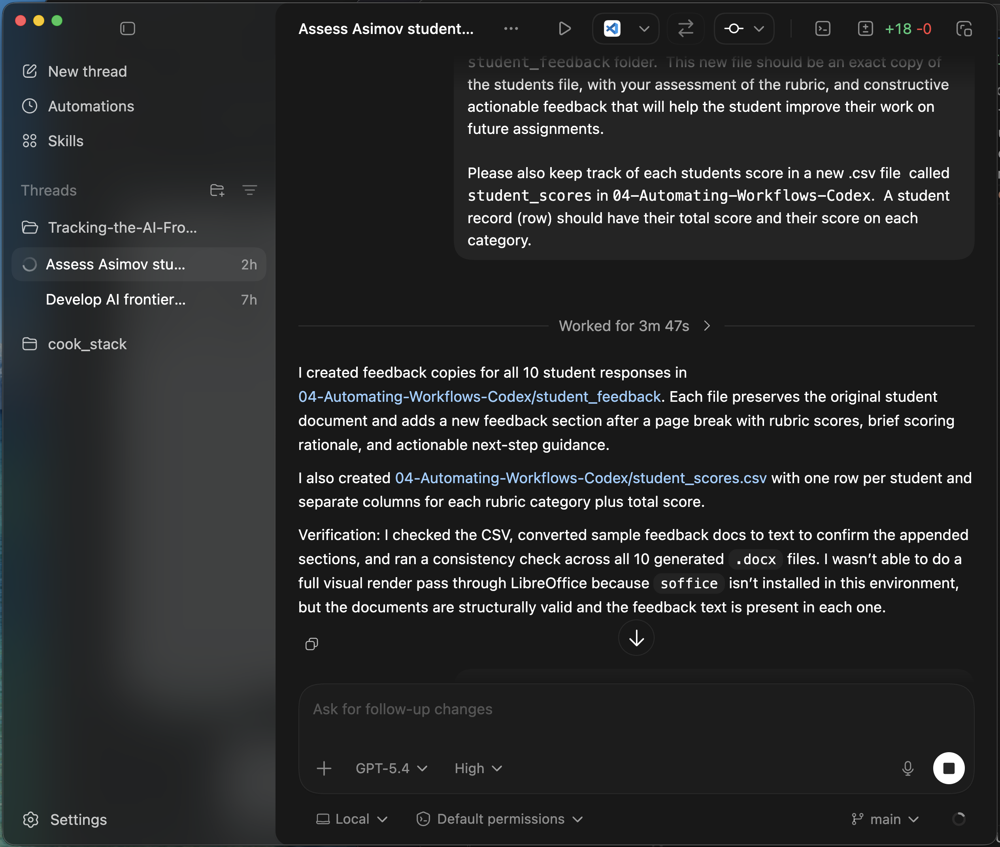

# Student-Facing Outputs

- 10 individualized feedback documents created
- Original student work preserved
- Rubric scores added
- Constructive, actionable next-step feedback appended
- `references/codex_example/student_scores.csv` generated for the whole class
