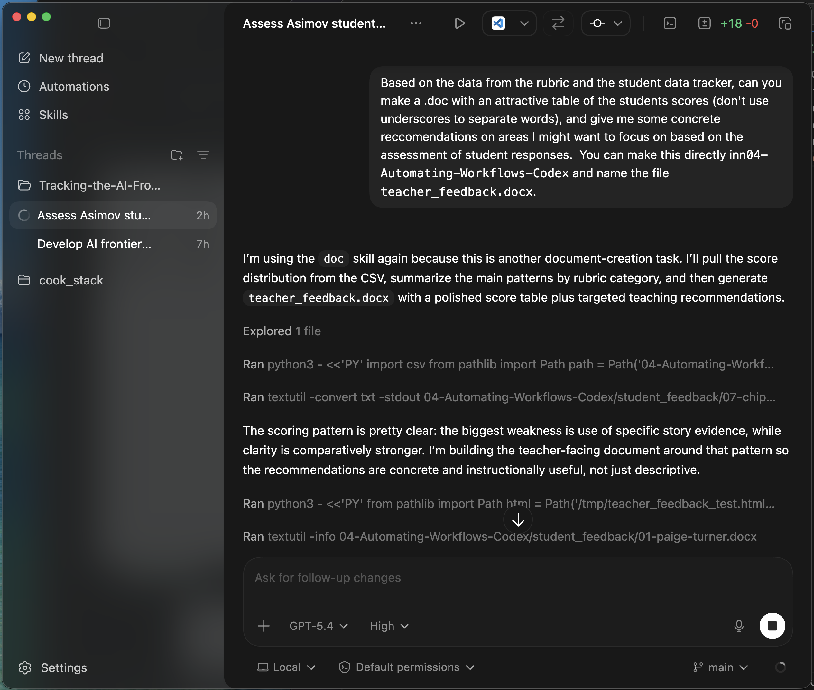

# Teacher-Facing Summary

- Class average: 4.7 out of 6
- Strongest category: Clarity and Focus of Writing
- Weakest category: Use of Story Evidence and Specific Details
- Teacher feedback report created with score table and instructional recommendations
